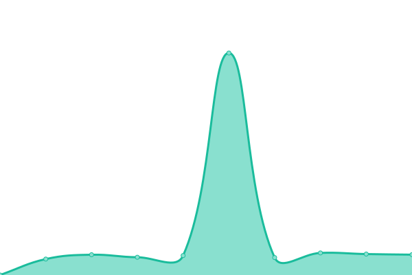

# [📈 Live Status](https://forbrukerradet.github.io/common-uptime): <!--live status--> **🟩 All systems operational**

This repository contains the open-source uptime monitor and status page for [Forbrukerrådet](https://forbrukerradet.github.io/common-uptime), powered by [Upptime](https://github.com/upptime/upptime).

With [Upptime](https://upptime.js.org), you can get your own unlimited and free uptime monitor and status page, powered entirely by a GitHub repository. We use [Issues](https://github.com/forbrukerradet/common-uptime/issues) as incident reports, [Actions](https://github.com/forbrukerradet/common-uptime/actions) as uptime monitors, and [Pages](https://forbrukerradet.github.io/common-uptime) for the status page.

<!--start: status pages-->
<!-- This summary is generated by Upptime (https://github.com/upptime/upptime) -->
<!-- Do not edit this manually, your changes will be overwritten -->
<!-- prettier-ignore -->
| URL | Status | History | Response Time | Uptime |
| --- | ------ | ------- | ------------- | ------ |
|  [Forbrukerrådet](https://www.forbrukerradet.no/) | 🟩 Up | [forbrukerradet.yml](https://github.com/Forbrukerradet/common-uptime/commits/HEAD/history/forbrukerradet.yml) | 

 1084ms
     
 | 

<a href="https://forbrukerradet.github.io/common-uptime/history/forbrukerradet">100.00%</a>
    

|  [Finansportalen](https://www.finansportalen.no) | 🟩 Up | [finansportalen.yml](https://github.com/Forbrukerradet/common-uptime/commits/HEAD/history/finansportalen.yml) | 

 1692ms
     
 | 

<a href="https://forbrukerradet.github.io/common-uptime/history/finansportalen">100.00%</a>
    

|  [Strømpris](https://www.strompris.no) | 🟩 Up | [strompris.yml](https://github.com/Forbrukerradet/common-uptime/commits/HEAD/history/strompris.yml) | 

 969ms
     
 | 

<a href="https://forbrukerradet.github.io/common-uptime/history/strompris">100.00%</a>
    

|  [Hvakostertannlegen](https://www.hvakostertannlegen.no/) | 🟩 Up | [hvakostertannlegen.yml](https://github.com/Forbrukerradet/common-uptime/commits/HEAD/history/hvakostertannlegen.yml) | 

 2584ms
     
 | 

<a href="https://forbrukerradet.github.io/common-uptime/history/hvakostertannlegen">99.96%</a>
    

<!--end: status pages-->

[**Visit our status website →**](https://forbrukerradet.github.io/common-uptime)

## 📄 License

- Powered by: [Upptime](https://github.com/upptime/upptime)
- Code: [MIT](./LICENSE) © [Forbrukerrådet](https://forbrukerradet.github.io/common-uptime)
- Data in the `./history` directory: [Open Database License](https://opendatacommons.org/licenses/odbl/1-0/)
